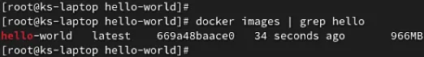
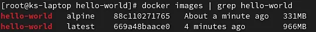
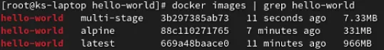

# Reduce the size of your Docker images drastically

<figure><figcaption></figcaption></figure>

In Docker, smaller containers lead us to run our applications more efficiently and securely. Also, those small containers use low resources. To run those small containers we need to make the images lighter as much as possible. Today I’m going to show you two ways to accomplish that.

1. Use a lightweight base image
2. Use multi-stage build

For example, I’m going to containerize a simple hello world program which is written in Go.

Here’s the code for the Hello World application.

```go
package main

import "fmt"

func main() {
   fmt.Println("Hello World")
}
```

Here’s the Dockefile to containerize this application.

```docker
FROM golang
WORKDIR /go/src/app
COPY . .
RUN go build -o hello-world .
CMD ["./hello-world"]
```

Let’s build the Docker image with the latest tag and check its size.

<figure><figcaption></figcaption></figure>

As we can see, the size of the image is 966 MB which is very large for that small application. Let’s see how we can reduce the image size.

### 1. Use a lightweight base image <a href="#1c6f" id="1c6f"></a>

Most of the base images we use in the Dockerfile have their own lightweight versions. You can find those lightweight images in [Docker Hub](https://hub.docker.com/) with alpine or slim tags. Here I’m using the Golang Alpine image as the base image to reduce the image size.

```docker
FROM golang:alpine
WORKDIR /go/src/app
COPY . .
RUN go build -o hello-world .
CMD ["./hello-world"]
```

Let’s build the Docker image with alpine tag and see what happens.

<figure><figcaption></figcaption></figure>

As we can see, the size of the new image is 331 MB which is less than the previous build. However, for a basic application like this, it’s still quite big. So Let’s now have a look at the second method and see what we can do about this.

### 2. Use multi-stage build <a href="#1274" id="1274"></a>

Here, I’m going to use the multi-stage build method to build the Docker image. If you are not familiar with this method [check this article](https://docs.docker.com/develop/develop-images/multistage-build/) before going further.

Here’s the Dockerfile which I’m going to use for the multi-stage build.

```docker
FROM golang:alpine as build
WORKDIR /go/src/app
COPY . .
RUN go build -o hello-world .


FROM alpine
WORKDIR /app
COPY --from=build /go/src/app /app
CMD ["./hello-world"]
```

This Dockerfile includes two stages. In the first stage, I’m building my go application. In the second stage, I’m copying my simple application build files and running them on the lightweight alpine Linux base image.

Let’s build this Docker image with the multi-stage tag and check its size.

<figure><figcaption></figcaption></figure>

As we can see the size of the new Docker image is 7.33 MB. The reason is image only includes the last stage build and the base image of that stage is Alpine Linux which is the lightest Linux image in the Docker Hub. Also, the last stage doesn’t include the Go environment like our previous images. We only copied application files and executed the build files of our application.

The advantage of the multi-stage build is we can reduce the size of the Docker image drastically. It will be really beneficial when the containers are running in production environments.

Hope you got a good idea about reducing the Docker image sizes! See you in another article 🫡

Thank you!
