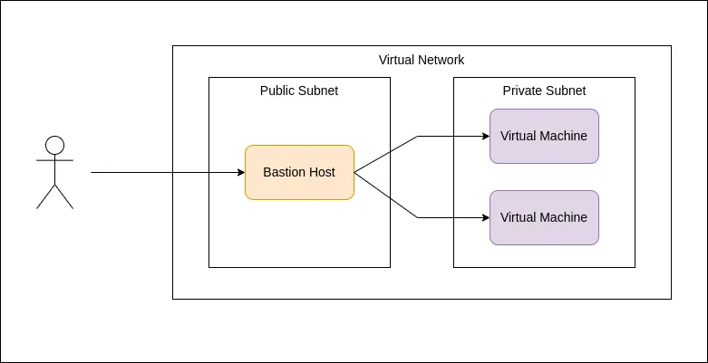

# Securing infrastructure using Bastion Host

<figure><figcaption></figcaption></figure>

Let’s say you have some virtual machines and you need to keep those private without exposing them to the public internet as a security concern. So you need to put those in a private network or avoid assigning public IPs to each VM.

But then how do we access those VMs remotely if they don’t have a public IP? That's where Bastion Host comes in.

### So what is Bastion Host? 

Bastion host is a single-purpose server that lets authorized users access a private network from an external network such as the Internet.

### How does it work? 

As I previously mentioned our VMs stayed private and don’t have public IPs. All of those only have private IPs. To access those VMs using private IPs, we can create a new virtual machine with a public IP called Bastion Host and only expose necessary ports to the public internet.

So we can access our VMs through our Bastion Host as this image shows.

<figure><figcaption></figcaption></figure>

### Advantages of Bastion Host 

* Reduce attack surfaces.
* Provides a single point for the logins in the network.
* Easy to manage the security and keep the focus on a single exposed VM rather than exposing all VMs to the internet.
* Easier to log all the attempts and take necessary measures for failing attempts.

### Disadvantages of Bastion Host  

* It is generally used only for SSH access to virtual machines.
* Bastion is an additional server to maintain.
* If the Bastion host gets attacked then all other VMs are in danger.
* If we lost access to the Bastion host then we lost access to all other VMs.

### Best practices when securing Bastion Host 

* Only use for single purposes.
* Access to the Bastion host must be limited to authorized users.
* Limit user accounts and restrict account capabilities.
* Only expose necessary ports to the public internet.
* Keep the system up to date and be aware of security vulnerabilities.

Hope you got a good idea about Bastion Host! See you in another article 🫡

Thank you!
